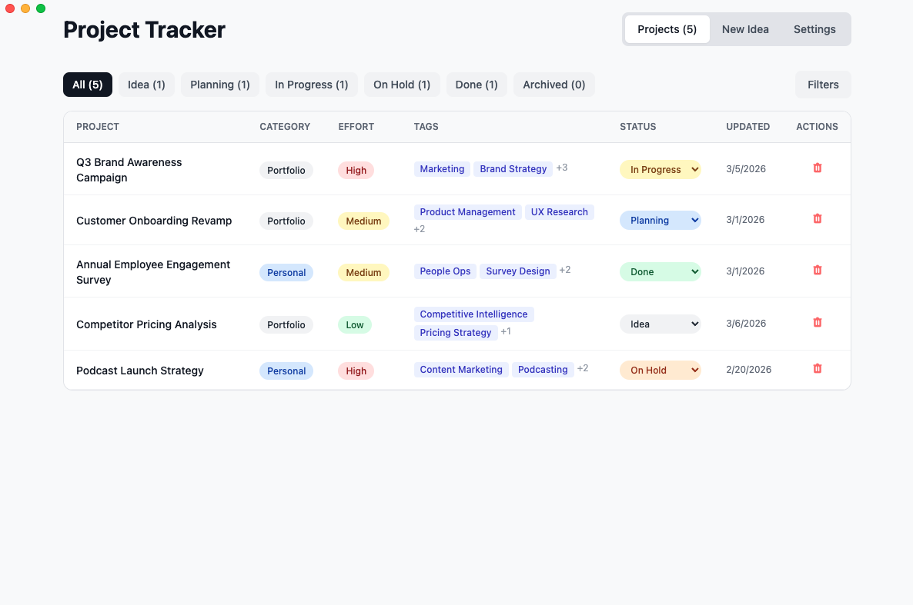
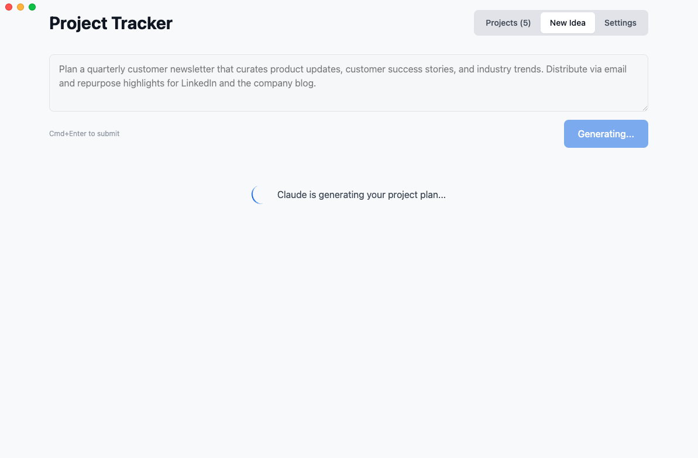
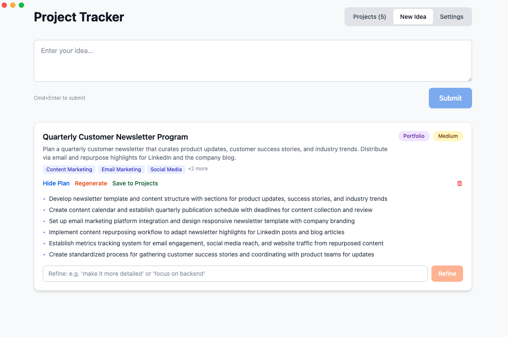
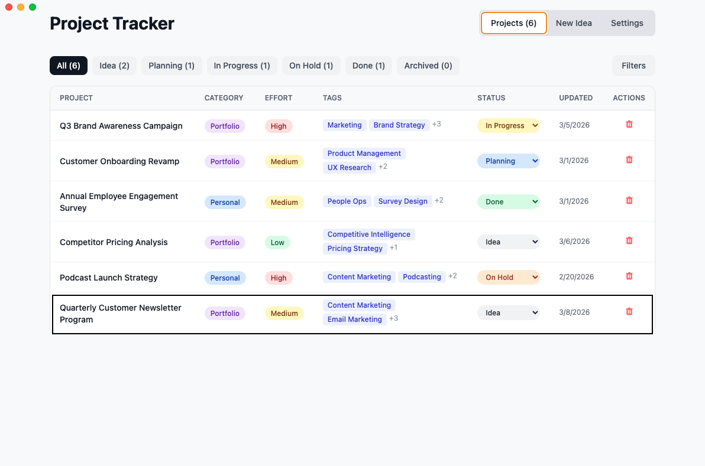
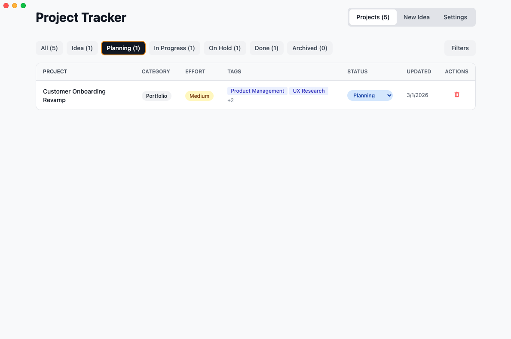
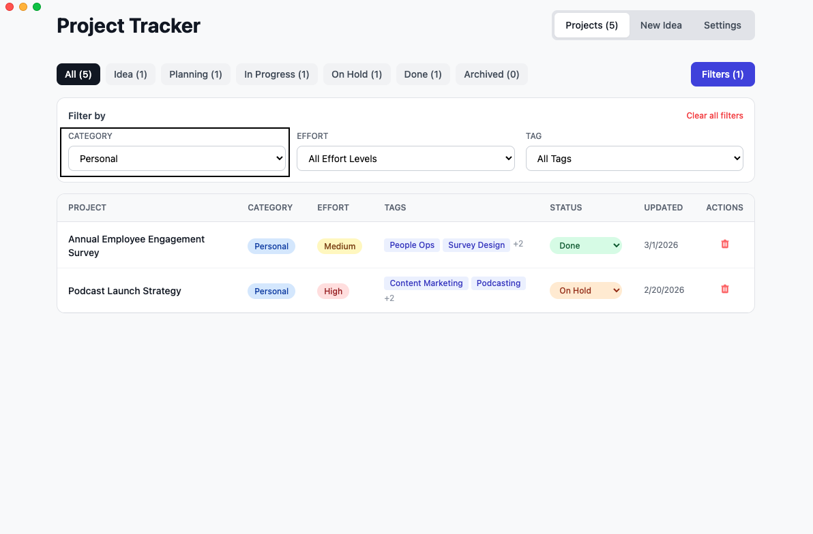
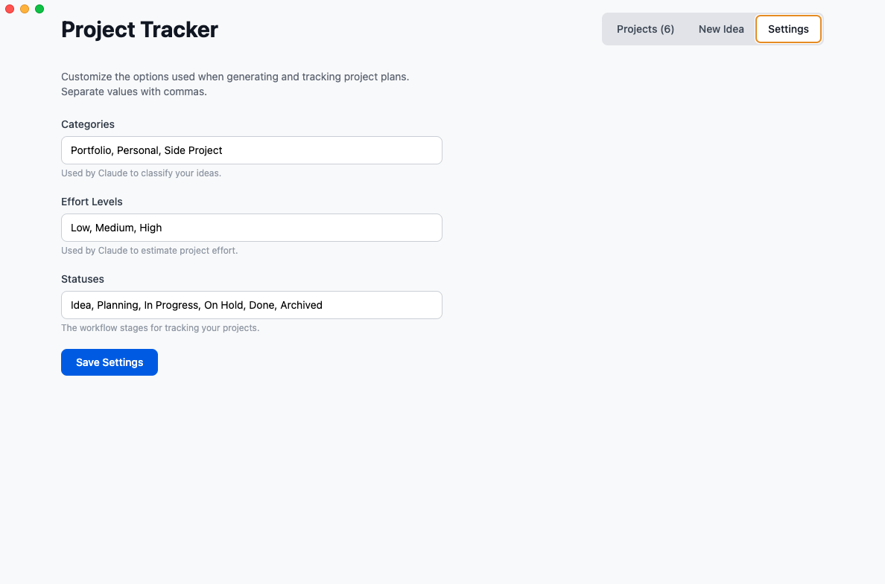

# Project Tracker

A desktop app for capturing ideas, generating project plans with Claude AI, and tracking them through customizable workflow stages. Built with React, Electron, and the Anthropic API.



## Features

- **AI-powered project plans** — Describe an idea in plain text and Claude generates a structured project plan with title, category, effort estimate, tags, and actionable steps
- **Refine with feedback** — Not happy with the plan? Provide feedback to refine it, or regenerate entirely
- **Customizable workflow** — Define your own status stages, categories, and effort levels from the Settings panel
- **Filter and sort** — Filter projects by status, category, effort, or tags. Click any column header to sort (ascending, descending, or reset)
- **Expandable project details** — Click any project to see its full plan, tags, and editable notes
- **Persistent local storage** — All data stored locally on your machine

## Tech Stack

- **Frontend**: React, Tailwind CSS, Vite
- **Backend**: Express.js, Anthropic Claude API
- **Desktop**: Electron, electron-builder

## Prerequisites

- [Node.js](https://nodejs.org/) (v18+)
- An [Anthropic API key](https://console.anthropic.com/)

## Setup

1. Clone the repository and navigate to the project folder:

   ```bash
   cd project-tracker
   ```

2. Install dependencies:

   ```bash
   npm install
   ```

3. Create a `.env` file with your Anthropic API key:

   ```
   ANTHROPIC_API_KEY=your-api-key-here
   ```

## Running

### Desktop App (Recommended)

**Preview mode** (builds and runs directly):

```bash
npm run electron:preview
```

**Build and install** as a macOS app:

```bash
npm run electron:build
cp -R "dist/mac-arm64/Project Tracker.app" /Applications/
```

You can then launch **Project Tracker** from Spotlight or Launchpad.

### Web Mode (Browser)

Run the backend server and Vite dev server together:

```bash
npm start
```

Then open [http://localhost:5173](http://localhost:5173).

## Project Structure

```
project-tracker/
  src/
    IdeaTracker.jsx     # React frontend (single-file)
    main.jsx            # React entry point
    index.css           # Global styles (Tailwind imports)
  assets/
    icon.png            # App icon (1024x1024 source)
    icon.icns           # macOS app bundle icon
    icon-padded.png     # Dock icon (padded + rounded)
  data/
    projects.sample.json  # Sample project data
  screenshots/          # App screenshots for documentation
  electron.js           # Electron main process
  server.js             # Express API server (Claude + CRUD)
  index.html            # HTML shell (Vite entry point)
  vite.config.js        # Vite configuration
  tailwind.config.js    # Tailwind CSS configuration
  postcss.config.js     # PostCSS configuration
```

## Data Storage

- **Desktop app**: Data is stored in `~/Library/Application Support/Project Tracker/`
- **Web mode**: Data is stored in the `data/` subdirectory

Data includes `projects.json` (your projects) and `settings.json` (your custom categories, effort levels, and statuses). On first launch of the desktop app, sample data is copied from the bundled `projects.sample.json`.

## Screenshots

### Generate a Project Plan

Enter your idea and Claude generates a structured plan:



### Review and Refine

Review the generated plan, refine it with feedback, or save it to your projects:



### Track Projects

View all your projects with status, category, effort, and tags at a glance:



### Filter by Status

Quickly filter projects by clicking any status in the toolbar:



### Advanced Filters

Use the Filters panel to narrow down by category, effort, or tags:



### Customize Settings

Define your own categories, effort levels, and workflow statuses:


